얼마 전, 맥북 키보드 중 하나의 키가 완전히 고장 나버렸다. 키캡을 제거하고 눌러도 키가 아예 반응이 없는 걸로 봐서는 키보드 전체를 바꿔야만 하는 최악의 상황에 놓이게 됐다.

## 어떤 방법으로 수리할 것인가

나에게는 크게 세 가지의 선택지가 있었다.

1. 애플 공식 센터에 내방하여 진단을 받고 수리 진행
2. 정품이 아닌 모조품 키보드를 싸게 구매하여 사설 센터에서 수리 진행
3. 직접 분해하고 모조품을 직접 조립 및 수리

음,, 1번 2번을 고민해보지 않은 것은 아니다.

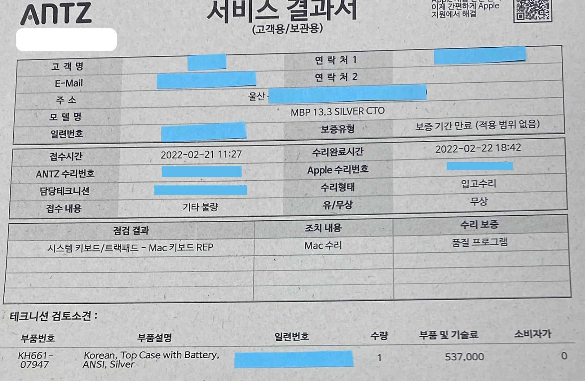

애플의 온라인 Support 상담으로는 죽어도 가격 얘기를 안해준다. 무조건 공식 서비스 센터에 방문하여 점검을 받고 이에 따라서 견적을 내줄 수 있다고 한다. 여기저기 서칭해 본 결과로는 나도 위와 비슷하게 최소 30만 원에서 많게는 50만 원까지도 지불해야 할 것으로 보인다.

> 맥북을 22년도부터 쓰기 시작했고 배터리도 이미 수명을 한참 다 한 상태라 배터리 교체를 피해갈 수 없을 것 같다. 맥북은 Top Case와 Keyboard가 한 세트라 여기에 배터리까지 포함하면 위 앙츠의 서비스 결과서 만큼 나올 가능성이 농후하다.

솔직히 너무 비싸다. 중고 시장에 에어 M1 기본형이 이 수리 비용과 비슷하게 팔린다. 바로 그돈씨 해버리는 ww

그래서 2번을 고민했다.

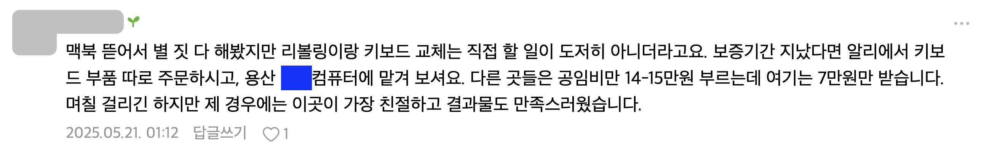

> "모조품이지만 뭐 어때? 비슷하게 잘 만들었겠지~"

이런 마음이 들기 시작했고, 가격이 싼 부품 비용 + 공임 비용까지 10만 원 전후로 끊을 수 있다고 알려주셨다.

> "이럴 바에는 공임비까지 아껴서 혼자 수리하면 되잖아!"

뭐,, 그렇게 됐다. 응당 공대생이라면 이런 관문은 한 번쯤 거쳐가야 하는 것. 그렇게 3번을 선택한 나는 무한 희망 회로를 그리며 알리익스프레스에서 필요한 모든 부품을 주문했다.

### 부품 주문서 및 가격

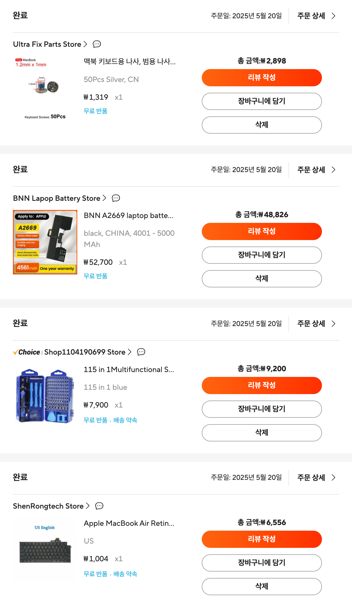

1. 키보드 부품 (₩6,556)
2. 분해 및 조립 공구 (₩9,200)
3. 배터리 (₩48,826)
4. 리벳 대체용 나사 (₩2,898)

총 지출 금액: ₩67,480

## 분해 과정

유튜브에 `a2681 disassembly` 키워드로 영상을 검색하면 너무나도 도움이 되는 영상들이 몇 개 있다.

나는 아래 동영상 두 개를 많이 참고했다.

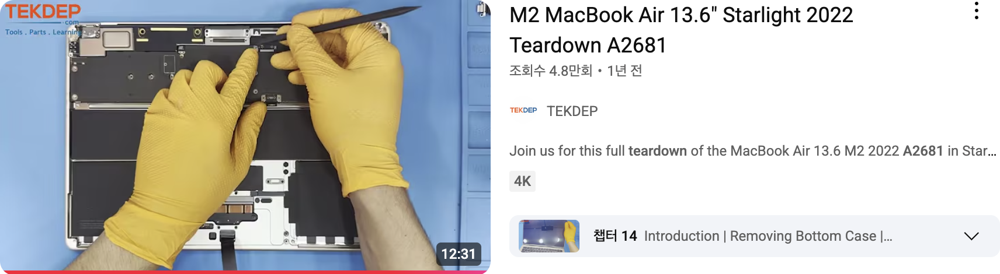

[M2 MacBook Air 13.6" Starlight 2022 Teardown A2681](https://youtu.be/PLXJ6qHjyWI?si=v_xdhETKV0qED4gz)

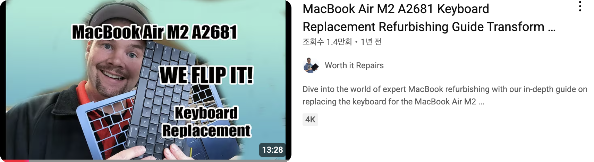

[MacBook Air M2 A2681 Keyboard Replacement Refurbishing Guide Transform a $20 Part into a $400 Repair
](https://youtu.be/iEpiyHgYX1Y?si=e8UB--YU4lbKaCOW)

키보드 교체가 난이도 극상인 이유 중 하나는 "모든" 부품을 다 분해해야 한다는 것이다. 밑에서부터 하나씩 떼면서 키보드까지 올라와야 하기 때문에 쉽지는 않다.

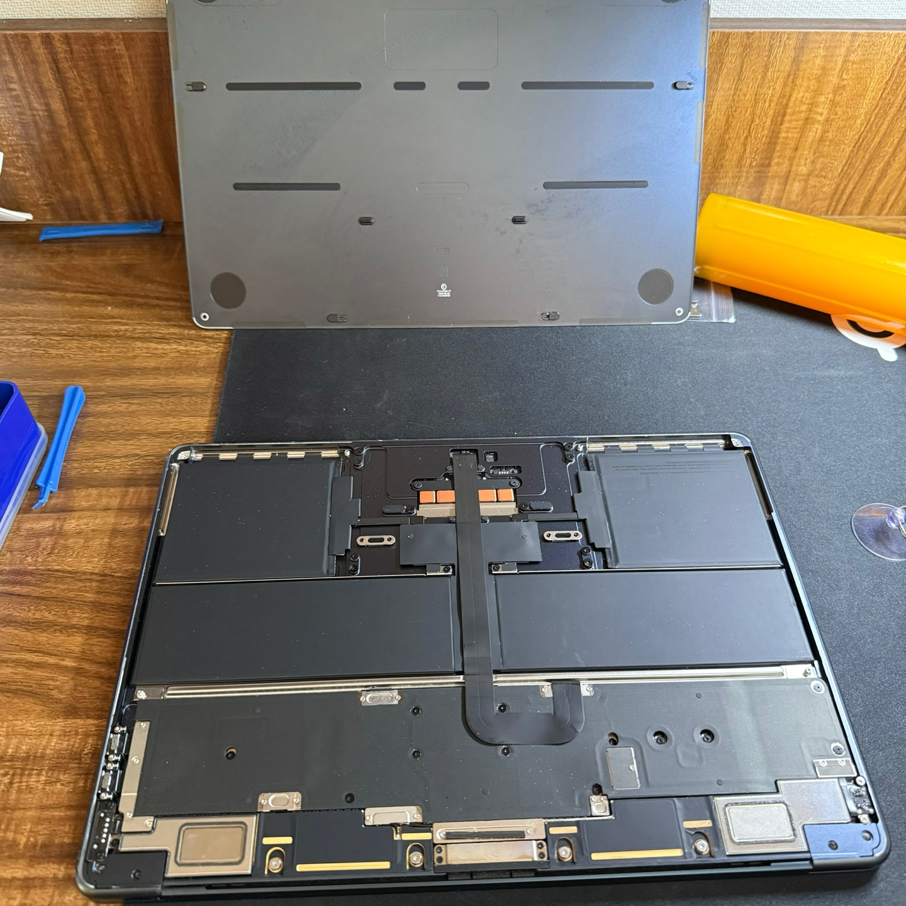

하판(뚜껑)을 뜯으면 대충 이렇게 생겼다. 배터리가 가장 크게 보이고, 그 위에 트랙패트 선이 마더보드와 연결되어 있다.

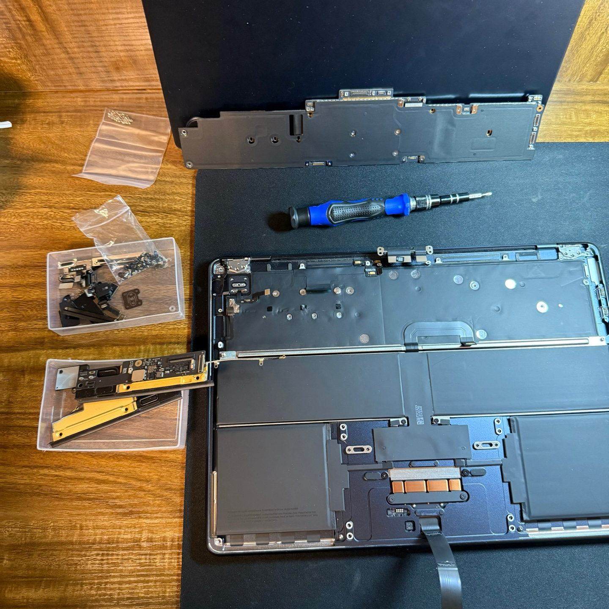

조심스럽게 마더보드와 그 주변 장치(스피커, C타입 포트, 맥세이프 DC 커넥터 등)를 제거한다.

> 모든 나사는 다르게 생겼고 전부 기억하지 못할 것이니 사진을 찍든 나사를 구분해서 보관하든 해라. 나처럼 귀찮다고 한 곳에 보관해버리면 조립할 때 언제 어떤 나사가 필요한지 한참을 고생하게 된다.

> 그리고 유튜브 영상을 완벽하게 따라가지는 마라. 영상에서는 t3, t5 screws 등으로 얘기하는데 이게 중국산 공구 탓인지 t4, t6 드라이버로 분해, 조립하는 게 더 잘 된다. 괜히 객기 부리면 나처럼 나사 몇 개는 야마 낼 수 있다.

> 참고로 여기서 제일 비싼 건 당연하게도 마더보드다. 잘못 건드렸다가는 죽도 못 쓰니 잘 보관하길 바란다.

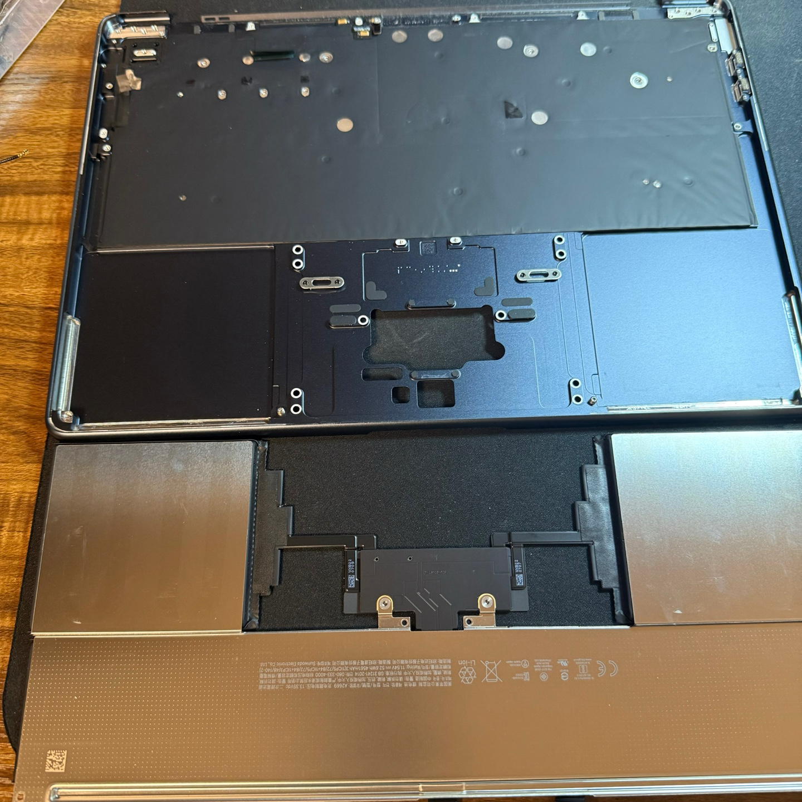

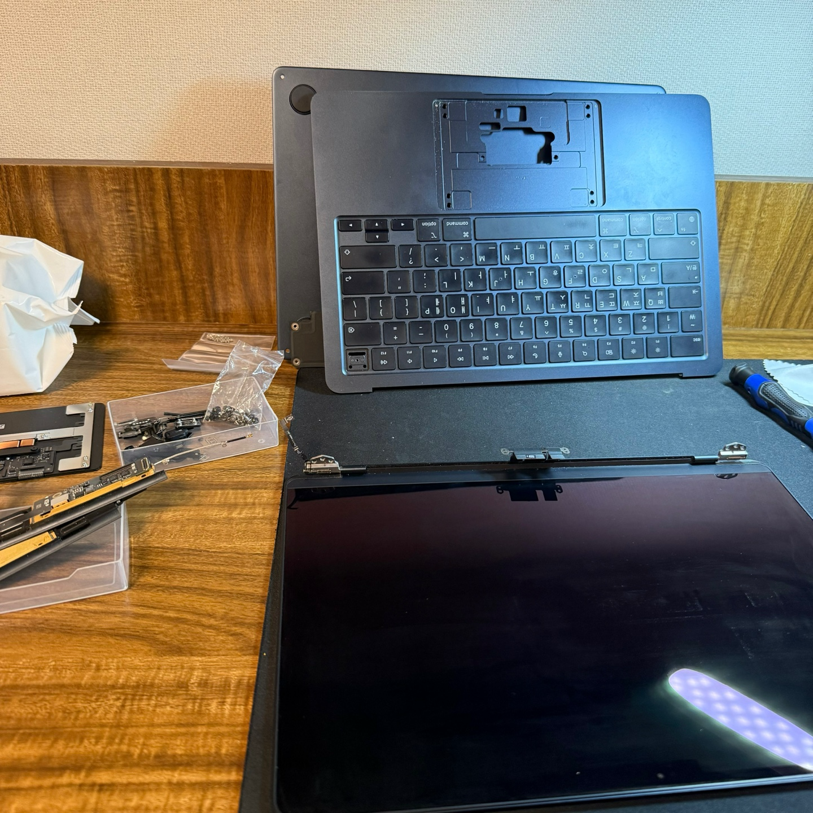

트랙패드, 배터리, 디스플레이, 백라이트까지 잘 분해했다면 이제 남은 건 단 하나.

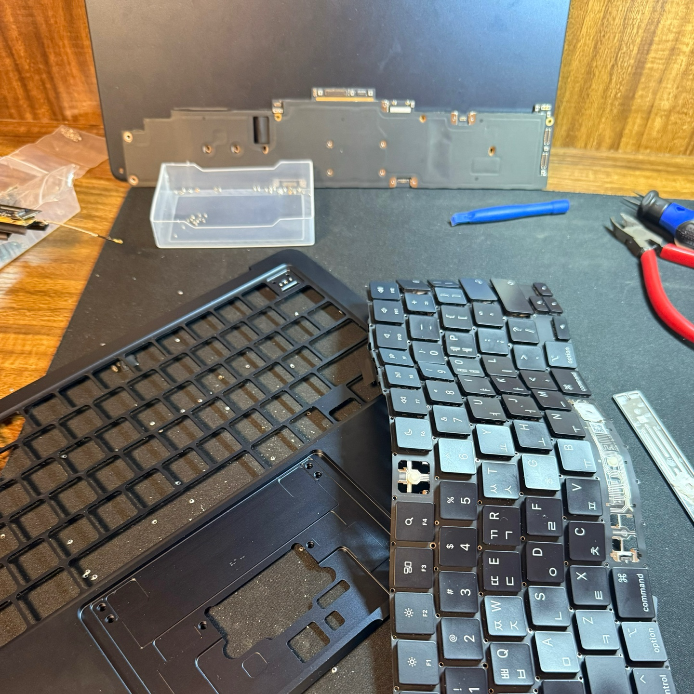

리벳으로 박혀 있는 키보드를 잘 잡아 뜯어주면 이렇게 정말 순살 상판이 남게 된다.

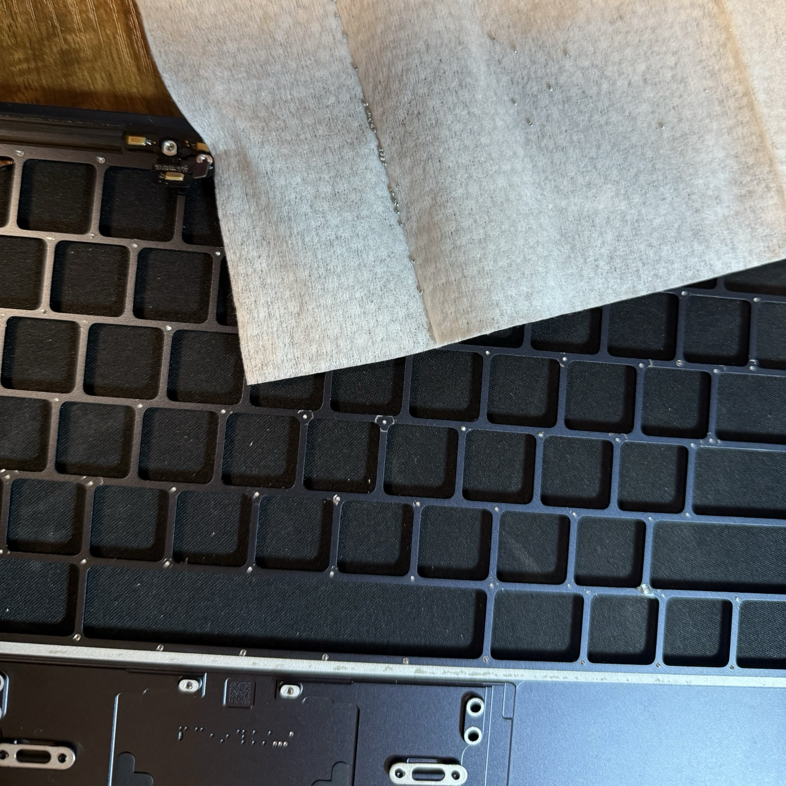

박혀 있던 리벳도 제거해야 하는데 많이 서칭을 해본 결과로는 수평으로 리벳 부분을 얇은 판을 대고 쳐서 빼내거나 리벳 제거 공구를 따로 사용하는 게 제일 쉽다고 한다.

근데 이것 조차도 쉽지 않아서 여러 테스트 끝에 현존하는 제일 쉬운 리벳 제거 방법을 직접 발견했다.

상판이 위로 오게 플라이어(뺀찌)로 리벳을 잡고 나사를 빼는 방향으로 생각해서 상판을 오른쪽으로 살살 돌리면 정말 쉽게 리벳이 제거된다. 제거 성공률 95% 이상 보장한다.

이렇게 분해쇼는 끝이 났다.

## 조립 과정

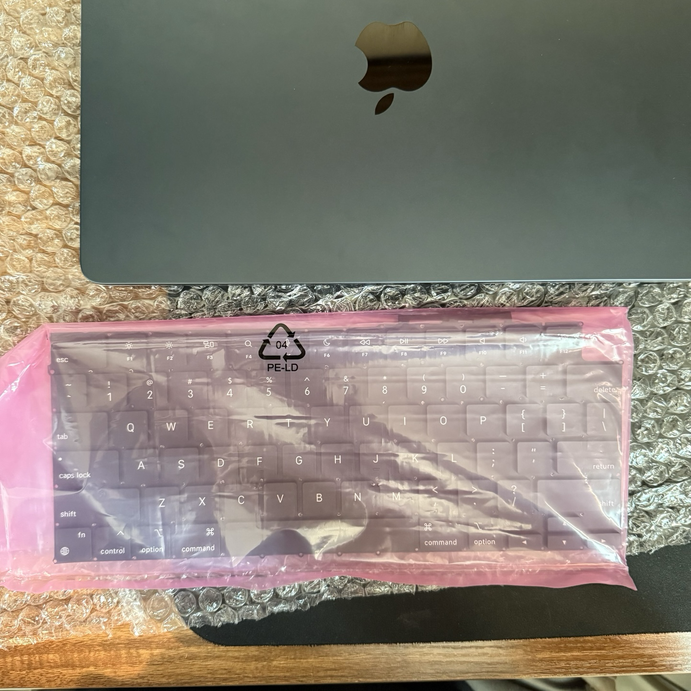

> 이건 알리에서 온 모조품 키보드다. 처음 받았을 때 나름 상태가 괜찮아 보여서 안심했다.

조립은 뭐다? 해체의 역순. 위에서 언급한 두 영상을 역재생 시켜 조립 과정에 도움을 보탰다.

### 문제 발생

기존에 있던 리벳 공간에 새로운 나사를 박으려 했는데 안 들어간다.

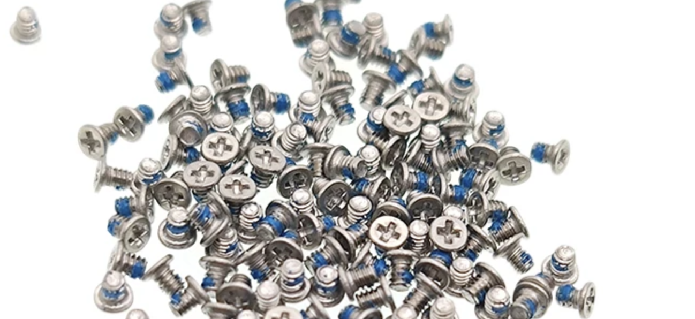

육안으로 확인했을 때는 확실히 나사의 직경이 리벳의 구멍보다 훨씬 큰 문제가 보였다.

아무래도 나사를 잘못 산 것 같다.. 내 모델에 맞는 리벳 구멍 대체용 나사를 구하는 게 생각보다 쉽지 않다. 제품도 잘 없는 것 같기도 하고.

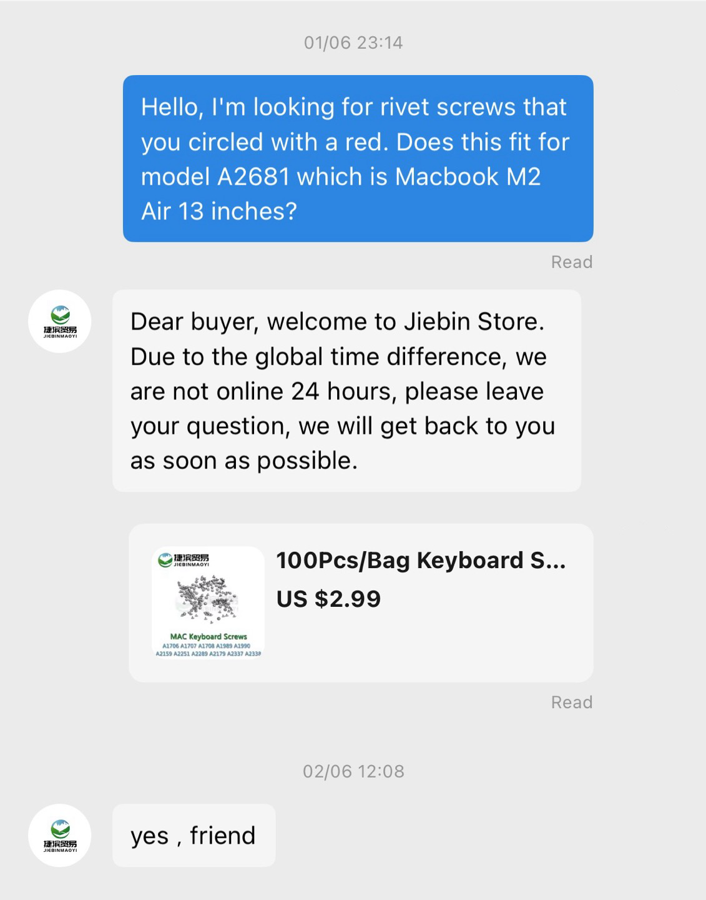

그래서 알리익스프레스에서 열심히 찾아보고 문의도 해서 또 새로운 나사를 주문했다.

그치만..

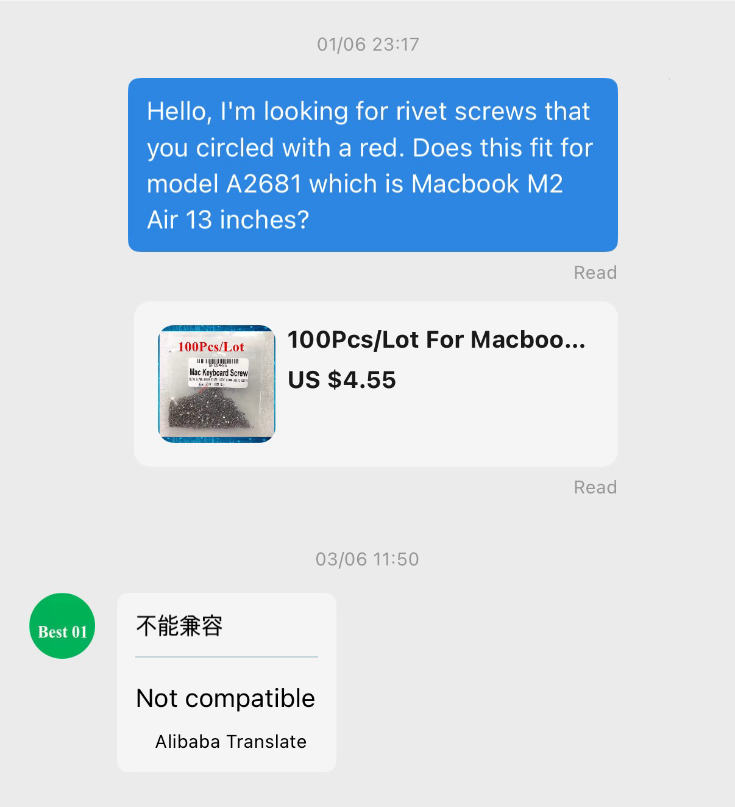

동일한 제품에 대해 누구는 잘 맞는다고 하고, 누구는 호환되지 않는다고 하면 누구의 말을 믿어야 할까?

까보기 전까지는 모르겠지만 드는 생각은 이러했다.

> "똑같은 제품이면 안된다고 하는 사람은 양심이 있고, 된다고 하는 사람은 어차피 비싸지도 않은데 그냥 팔기 위해서 된다고만 하는 거 아닐까?"

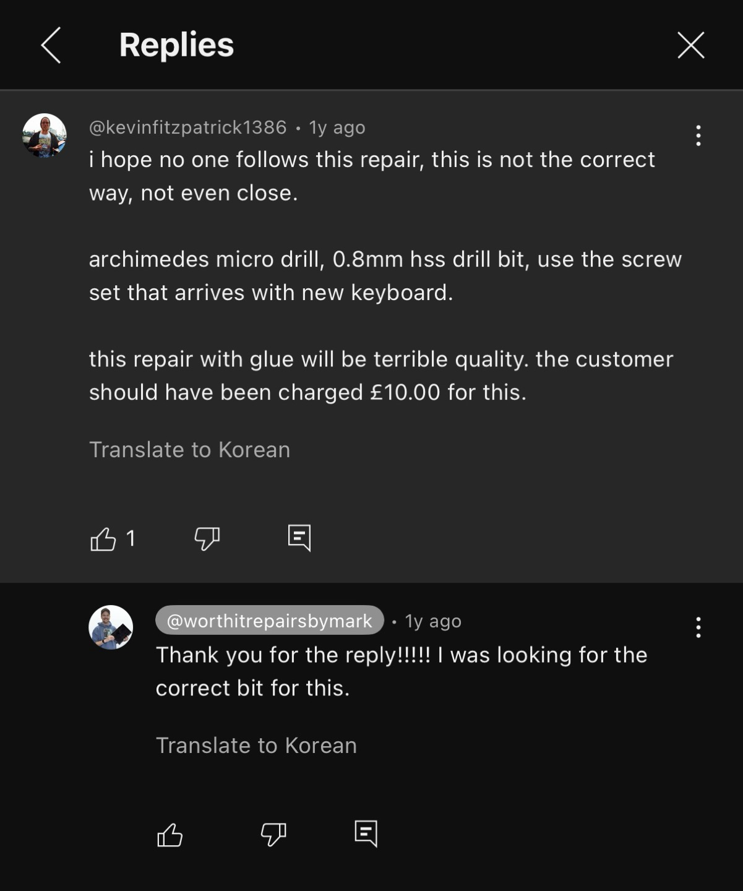

유튜브 영상 중에서는 0.8mm hss 드릴 비트로 구멍을 내서 박아야 한다고 하는 댓글도 있었다.

> "그럼 리벳 구멍에 나사산이 없는 건가?"

점점 확신은 없어지고.. 해외직구는 오래 걸리고..

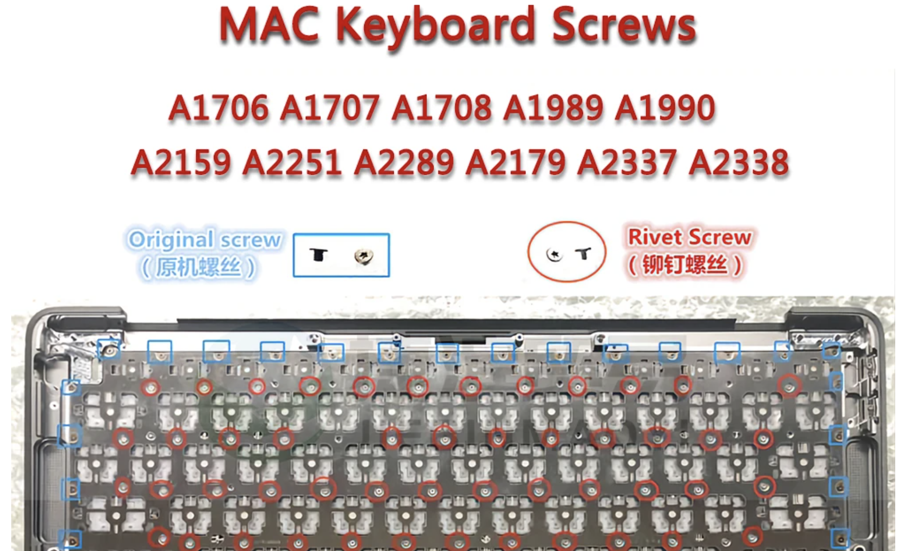

이 제품을 주문은 했지만 포기하기로 했다. 참을 수가 없었다.

(혹시라도 제가 구매한 리벳 구멍 대용 나사가 필요하시다면 연락주세요. 그냥 드리겠습니다.)

### 그냥 조립해

키보드의 테두리의 경우 기존 `t3` 나사로 채우고, 키보드 안쪽은 상판의 일부와 함께 접착제로 붙였다.

내가 원하는 방법은 아니었지만 보이는 것도 아니고 해결만 된다면 크게 상관은 없었다.

## 결과

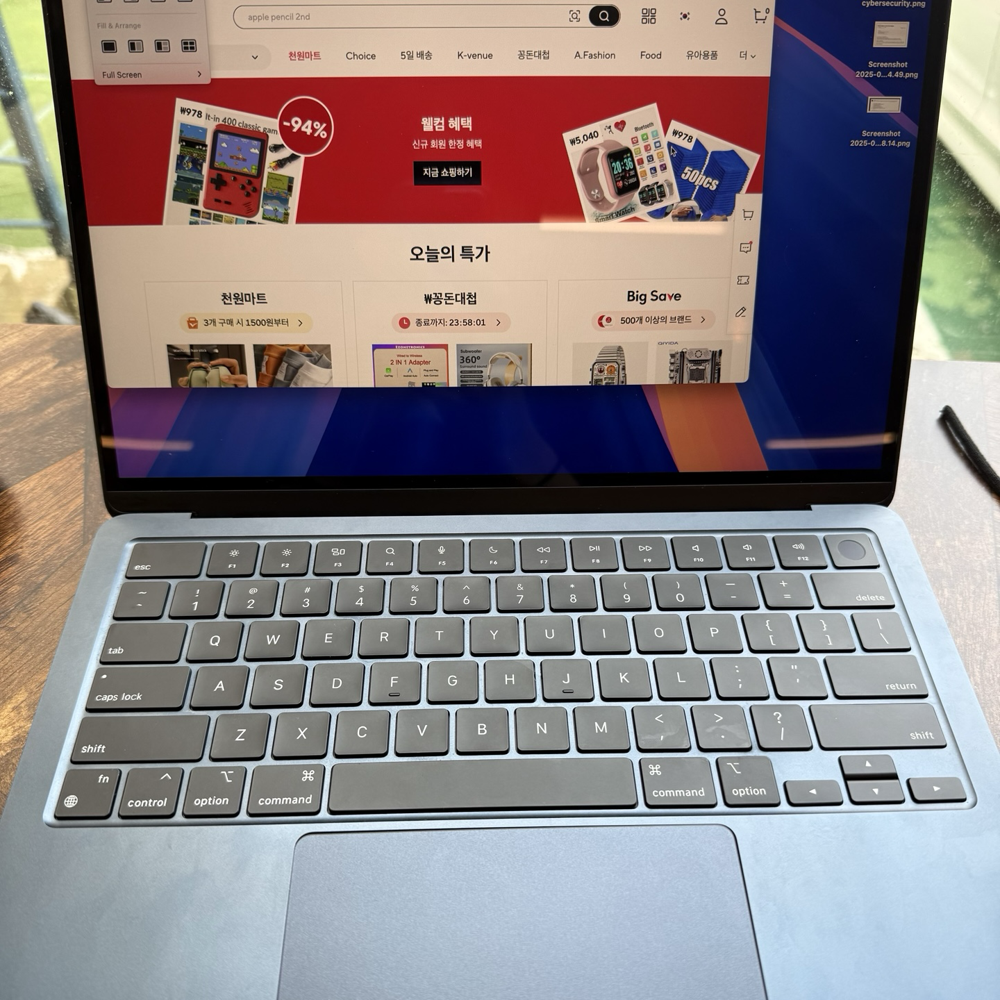

짜잔! 모든 부품이 정상적으로 동작한다. 배터리 타임도 충분히 길어지고, 안 눌리던 키도 이제는 잘 된다.

### 사실 긍정적이진 않음

부품이야 전부 정상이라 사용하는 데에 있어 크게 문제가 되진 않는다.

다만, 정품 키보드가 아니라서 이 제품의 마감이 너무 아쉽다는 점이다. 키감이 전부 균일하지도 않고, 전체적으로 뻑뻑하다. 너무 문제가 되는 키는 대부분 금속 막대가 있는 키였는데 이걸 기존 키보드에 있던 걸로 교체하니 조금은 나아지긴 했다.

그리고, 나의 나사 조임 미숙으로 현재 파워/터치 아이디 버튼과 트랙패드가 왼쪽으로 살짝 틀어져서 유격이 생겼다. 나사가 네 군데가 있으면 같이 조였어야 했는데 하나씩 쭉쭉 조립하다보니 그렇게 됐다. 엉엉 ㅠ.ㅠ

> 금방 다시 뜯고 재조립은 할 수 있지만 조금은 다른 방법을 고안해보기로 한다.

## 자가 수리의 장점과 단점단점단점

장점

- 저렴한 비용

단점

- 일부 부품의 경우 정품 사용 불가 (퀄리티가 사용자 경험으로 이어짐)
- 공식 수리 불가 (임의로 분해한 제품은 이제 공식 센터에서 수리 불가하다)
- 아쉬운 조립 마감 (숙련자가 아니고서는 공장처럼 완벽하게 조립하기는 쉽지 않다. 분해, 조립 과정에서 스크래치도 생기고.)

> 부품만 정품으로 수급이 가능하다면 도전해볼 가치는 여전히 있다고 생각한다.

## 끝이 아니다

결국 나는 이렇게 만족하지 못했다.

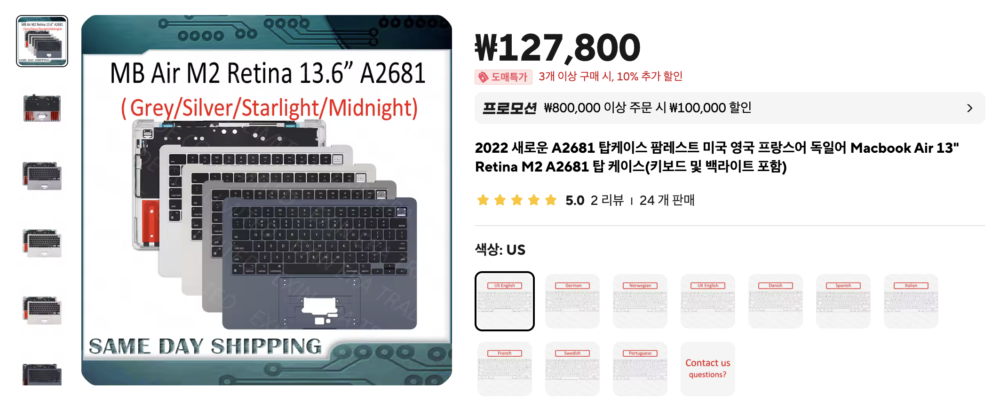

좀 큰 돈을 들여 정품에서 분리한 Top Case + Keyboard 즉, 상판을 통째로 주문했다.

한 번 뜯어봤으니 두 번은 더 잘 할 수 있지 않을까? 기대를 하며 A2681의 키보드 자가교체 후기는 마무리 한다.
